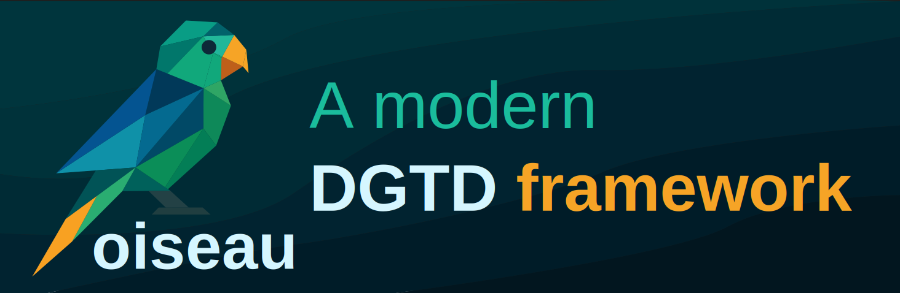

**oiseau** is a specialized **Discontinuous Galerkin Time-Domain (DGTD)**
framework designed for advanced simulation of electromagnetic and wave
propagation problems. This modular and research-oriented tool aims to support a
wide range of complex materials, including dispersive and anisotropic media.

> ⚠️ **Work in Progress**
> oiseau is still under active development. APIs, features, and interfaces may evolve quickly.

## ✨ Features (Planned)

- Modular DGTD core
- Support for dispersive materials via ADE models
- Anisotropic and doubly dispersive media handling
- Vector fitting and complex pole-residue modeling
- Future support for scripting interfaces (e.g., Python)

## 📦 Installation

Installation instructions will be added as the project matures and reaches a more stable phase.

## 📚 Documentation

Complete documentation is in progress and will be released with the first stable version.

## 🤝 Contributing

Contributions are welcome! See [CONTRIBUTING.md](CONTRIBUTING.md) for guidelines.

## 🧪 License

This project is licensed under the **GNU General Public License v3.0 (GPL-3.0)**.
See the [LICENSE](LICENSE) file for more details.
